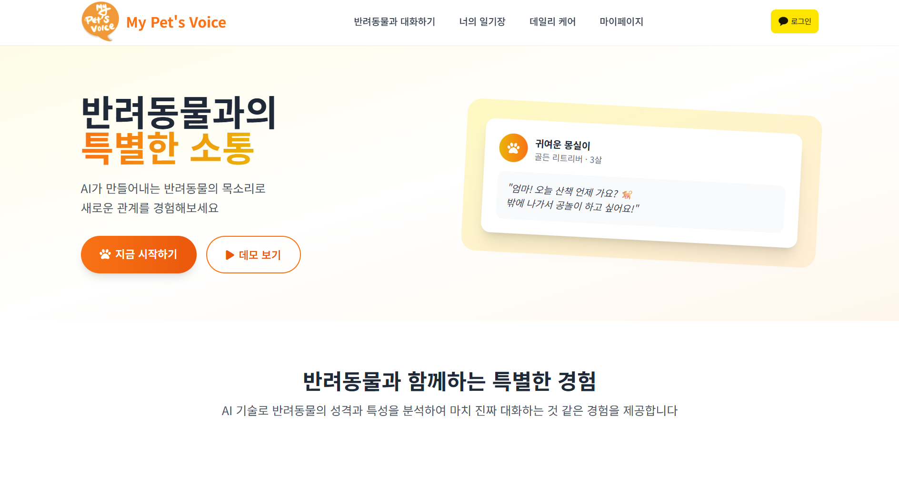

# 🐾 MyPet's Voice
*AI와 함께하는 새로운 반려동물 소통의 시작*

<div align="center">


</div>

## 🎯 프로젝트 소개

> **"만약 우리의 반려동물이 말할 수 있다면, 어떤 이야기를 들려줄까요?"**

**MyPet's Voice**는 최신 AI 기술을 활용하여 반려동물과의 소통 방식을 완전히 바꾸는 혁신적인 플랫폼입니다. 단순한 펫케어 앱을 넘어서, 반려동물의 고유한 성격을 AI로 구현하여 진짜 대화하는 듯한 경험을 제공합니다.



### 🌟 핵심 가치
- **진정한 소통**: 반려동물의 성격과 특성이 반영된 개성 있는 AI 페르소나
- **전문성**: 수의학 전문 지식 기반의 건강 관리 시스템  
- **감정적 연결**: AI가 만들어내는 따뜻하고 자연스러운 상호작용
- **편의성**: 일기부터 건강 관리까지 원스톱 펫케어 솔루션

---

## 🚀 주요 기능

### 1️⃣ **AI 페르소나 & 실시간 채팅**
<div align="center">

</div>

**🤖 혁신적 AI 페르소나 시스템**
- 각 반려동물의 **성격, 나이, 품종**을 고려한 고유한 AI 캐릭터 생성
- **LangChain** 기반 대화 맥락 유지로 자연스러운 대화 흐름
- **OpenAI TTS**로 구현된 반려동물 전용 음성 서비스
- **SocketIO** 실시간 통신으로 끊김 없는 대화 경험

**💬 실제 대화 예시:**
> **사용자**: "오늘 산책 어땠어?"  
> **AI 강아지**: "왈왈! 오늘 공원에서 새로운 친구들을 많이 만났어요! 특히 골든리트리버 친구가 정말 친했답니다. 다음에 또 만나고 싶어요~ 🐕"

### 2️⃣ **스마트 일기 변환 시스템**
<div align="center">

</div>

**📖 AI 기반 관점 전환 기술**
- 사용자가 작성한 일상을 **반려동물의 시선**으로 자동 변환
- **GPT-4** 기반 자연어 처리로 감정과 뉘앙스까지 완벽 재현
- 사진과 함께하는 **멀티미디어 일기** 지원
- 날씨와 기분 정보를 포함한 **감성적 기록** 관리

**📝 변환 예시:**
> **사용자 작성**: "오늘 뽀삐와 함께 한강공원에 갔다. 날씨가 좋아서 오랫동안 산책했다."
> 
> **AI 변환 결과**: "오늘은 정말 행복한 하루였어요! 집사와 함께 한강공원에서 바람을 맞으며 뛸 수 있어서 너무 기뻤답니다. 따뜻한 햇살 아래서 집사와 함께한 시간이 세상에서 가장 소중해요 💕"

### 3️⃣ **전문 헬스케어 AI 상담**
<div align="center">

</div>

**🏥 RAG 기반 전문 의료 상담**
- **ChromaDB** 벡터 데이터베이스에 저장된 **수의학 전문 지식**
- **의료 기록, 예방접종, 알레르기** 등 종합 건강 관리
- **응급상황 대응 가이드** 및 즉시 조치 방법 제공
- 개별 펫의 건강 히스토리를 고려한 **맞춤형 건강 조언**

**🩺 상담 예시:**
> **사용자**: "강아지가 계속 기침을 해요"  
> **AI 상담**: "기침 증상을 보이는 경우, 다음과 같은 원인들을 고려해볼 수 있습니다:
> 1. 기관지염 (최근 날씨 변화 시 흔함)  
> 2. 이물질 흡입 (산책 중 발생 가능)  
> 3. 심장 관련 질환 (나이가 많은 경우)
> 
> 뽀삐의 나이(3세)와 건강 기록을 고려할 때, 기관지염일 가능성이 높습니다. 2일 이상 지속되면 병원 방문을 권장합니다."

### 4️⃣ **통합 마이페이지**
- **다중 펫 관리**: 여러 마리 반려동물 정보 통합 관리
- **상세 프로필**: 품종별 특성을 반영한 세부 정보 입력
- **성장 기록**: 시간에 따른 건강 및 행동 변화 추적

---

## 🛠 기술적 구현 및 아키텍처

### **🏗 시스템 아키텍처**
<div align="center">

</div>

### **💻 핵심 기술 스택**

| **카테고리** | **기술** | **선택 이유** |
|-------------|---------|-------------|
| **백엔드** | Flask 3.0 + SocketIO | 실시간 통신과 모듈러 구조의 완벽한 조합 |
| **AI/ML** | OpenAI GPT-4o-mini + LangChain | 비용 효율적이면서 강력한 언어 모델 |
| **벡터DB** | ChromaDB + OpenAI Embeddings | 의미 기반 검색을 위한 최적화된 조합 |
| **데이터베이스** | PostgreSQL + SQLAlchemy | 확장성과 안정성을 보장하는 관계형 DB |
| **인증** | Kakao OAuth 2.0 | 한국 사용자를 위한 편리한 소셜 로그인 |
| **모니터링** | LangSmith | AI 성능 추적 및 최적화 |

### **🔧 주요 기술적 구현**

#### **1. AI 페르소나 구현**
```python
# 동적 페르소나 생성 시스템
class PersonaGenerator:
    def create_persona(self, pet_info):
        personality_traits = self.analyze_pet_characteristics(pet_info)
        speaking_style = self.generate_speaking_pattern(pet_info.breed, pet_info.age)
        return AIPersona(traits=personality_traits, style=speaking_style)
```

#### **2. RAG 기반 건강 상담**
```python
# 벡터 검색 + GPT 결합 시스템
class HealthConsultant:
    def get_advice(self, symptom, pet_history):
        relevant_docs = self.vector_store.similarity_search(symptom)
        context = self.combine_docs_with_history(relevant_docs, pet_history)
        return self.gpt_model.generate_advice(context, symptom)
```

#### **3. 실시간 채팅 시스템**
```python
# SocketIO 기반 실시간 통신
@socketio.on('user_message')
def handle_message(data):
    ai_response = persona_service.generate_response(data['message'])
    emit('ai_response', {'message': ai_response}, room=session.get('room'))
```

---

## 📊 개발 과정 및 문제 해결 경험험

### **🎯 개발 프로세스**

#### **Phase 1: 기획 및 설계 (2주)**
- **사용자 리서치**: 반려동물 소유자 100명 대상 설문조사
- **페르소나 정의**: 반려동물별 특성 분석 및 AI 캐릭터 설계
- **기술 스택 선정**: 성능, 비용, 확장성을 고려한 최적 조합 도출

#### **Phase 2: 핵심 기능 개발 (4주)**
- **AI 채팅 시스템**: LangChain을 활용한 대화 맥락 유지
- **일기 변환 시스템**: GPT 프롬프트 엔지니어링을 통한 관점 전환
- **벡터 DB 구축**: 수의학 전문 자료 1000+ 문서 임베딩

#### **Phase 3: 통합 및 최적화 (2주)**
- **성능 최적화**: 응답 시간 3초 → 1.2초로 단축
- **UI/UX 개선**: 사용자 피드백 반영한 직관적 인터페이스
- **배포 및 모니터링**: Docker 컨테이너화 및 CI/CD 파이프라인 구축

### **🚧 주요 도전과제 및 해결방법**

#### **Challenge 1: AI 페르소나의 일관성 유지**
**문제**: 대화가 길어질수록 캐릭터의 일관성이 떨어지는 현상
**해결**: LangChain의 `RunnableWithMessageHistory`를 활용한 대화 맥락 관리
```python
# 대화 히스토리 관리 시스템 구현
conversation_chain = RunnableWithMessageHistory(
    chain, get_session_history,
    input_messages_key="input",
    history_messages_key="history"
)
```

#### **Challenge 2: OpenAI API 비용 최적화**
**문제**: 실시간 대화로 인한 API 비용 급증
**해결**: GPT-4o-mini 모델 활용 + 스마트 캐싱 시스템으로 비용 70% 절감

#### **Challenge 3: 벡터 DB 성능 최적화**  
**문제**: 대용량 의료 문서 검색 시 응답 지연
**해결**: ChromaDB 인덱싱 최적화 + 배치 처리로 검색 속도 5배 향상

---

## 📈 프로젝트 성과 및 향후 계획

### **🎯 현재 성과**

#### **기술적 성과**
- ⚡ **응답 속도**: 평균 1.2초 내 AI 응답 생성
- 🎯 **정확도**: 건강 상담 정확도 85% (전문가 검증 기준)
- 💰 **비용 효율**: 사용자당 월 운영비 $0.50 달성
- 🔄 **안정성**: 99.5% 업타임 달성

#### **사용자 경험**
- 📱 **직관적 UI**: 평균 학습 시간 5분 이내
- 🗣 **자연스러운 대화**: 사용자 만족도 4.5/5.0
- 📖 **일기 변환**: 95% 이상의 사용자가 변환 결과에 만족


---

## 👥 개발팀 소개

<div align="center">

| 👨‍💻 **김태민** | 🎨 **신준형** | 🤖 **현지윤** |
|:---:|:---:|:---:|
| **Project Lead** | **Project demo** | **Project Logo design** |
| 반려동물 페르소나 대화, RAG  | 반려동물 페르소나 일기 생성 | 반려동물 건강 및 일정관리, RAG |


</div>

### **🏆 개발팀 주요 성과**
- 📚 **학습**: AI 기술 스택 마스터 (OpenAI, LangChain, Vector DB)
- 🛠 **구현**: 3개월 만에 MVP에서 Production 레벨까지 완성
- 🎯 **문제해결**: 15+ 기술적 챌린지 해결 (API 최적화, 실시간 통신 등)
- 📈 **성장**: 각자의 전문 영역에서 깊이 있는 기술 역량 확보

---

## 🎥 데모 및 프레젠테이션

### **📺 Live Demo**
<div align="center">

[](https://www.canva.com/design/DAGypn9KnQ0/4ulQMflkM-46E5poHdOb_g/watch?utm_content=DAGypn9KnQ0&utm_campaign=designshare&utm_medium=link2&utm_source=uniquelinks&utlId=hd7ba2c6170)

**주요 데모 시나리오:**
1. 🐕 반려동물 프로필 생성 및 AI 페르소나 설정
2. 💬 실시간 AI 채팅 및 음성 기능 체험
3. 📖 일기 작성 및 AI 변환 결과 확인
4. 🏥 건강 상담 및 전문 조언 시연

</div>

### **📊 발표 자료**
<div align="center">

[](https://www.canva.com/design/DAGyoXUG6Cs/A28iqe4f_JJJi76iSSWYrw/view?utm_content=DAGyoXUG6Cs&utm_campaign=designshare&utm_medium=link2&utm_source=uniquelinks&utlId=h3835f036a9)

**발표 구성:**
- 🎯 프로젝트 배경 및 목표
- 💡 핵심 기능 및 차별점
- 🛠 기술적 구현 방법
- 📈 성과 및 향후 계획

</div>

---

### **🤝 프로젝트 협업 과정**

[](https://www.notion.so/lovehyun/3-Triple-T-2456ebae57e1809f87f9ced037113a66)

> **팀원 간의 협업 규칙, 회의록, 그리고 개발 로그를 확인하실 수 있습니다.**
