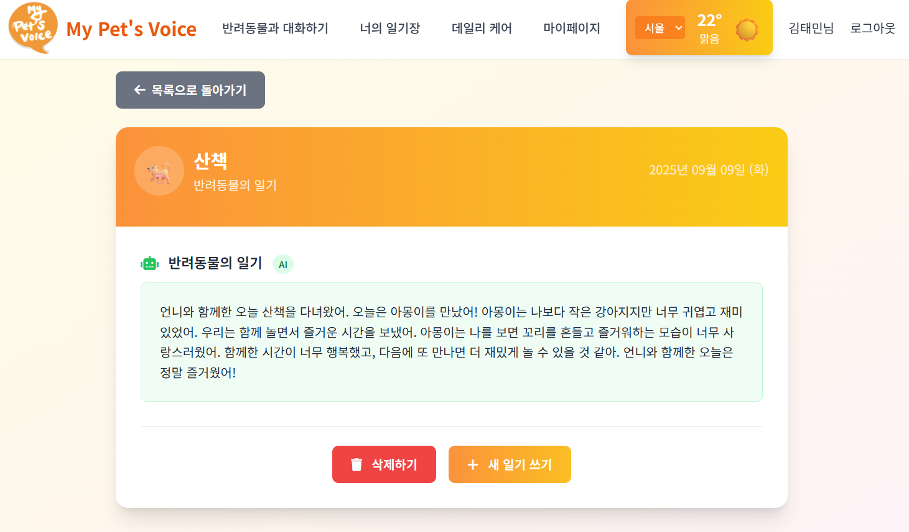
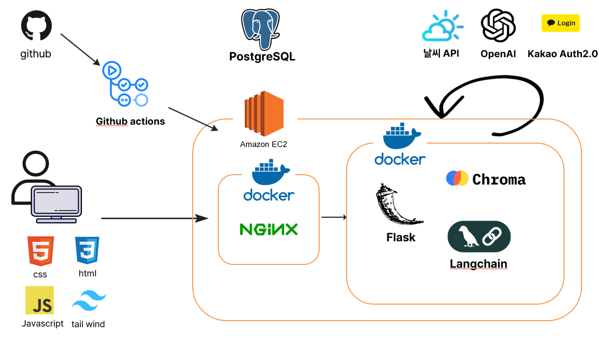

# 🐾 MyPet's Voice
*AI와 함께하는 새로운 반려동물 소통의 시작*

## 🎯 프로젝트 소개

> **"만약 우리의 반려동물이 말할 수 있다면, 어떤 이야기를 들려줄까요?"**

**MyPet's Voice**는 단순한 펫케어 앱을 넘어서, 최신 AI 기술을 활용하여 반려동물의 고유한 성격을 AI로 구현하여 진짜 대화하는 듯한 경험을 제공합니다.

### 🌟 핵심 가치
- **진정한 소통**: 반려동물의 성격과 특성이 반영된 개성 있는 AI 페르소나
- **전문성**: 반려동물 건강 지식 기반의 건강 관리 시스템  
- **감정적 연결**: AI가 만들어내는 따뜻하고 자연스러운 상호작용
- **편의성**: 일기로 반려동물과의 추억을 기록하고, 건강 관리까지 할 수 있는 원스톱 펫케어 솔루션

---

## 🚀 주요 기능

### 1️⃣ **AI 페르소나 & 실시간 채팅**

**🤖 혁신적 AI 페르소나 시스템**
- 각 반려동물의 **성격, 나이, 품종**을 고려한 고유한 AI 캐릭터 생성
- **LangChain** 기반 대화 맥락 유지로 자연스러운 대화 흐름
- **OpenAI TTS**로 구현된 반려동물 전용 음성 서비스

**💬 실제 대화 예시:**
> **사용자**: "오늘 산책 어땠어?"  
> **AI 강아지**: "오늘 공원에서 새로운 친구들을 많이 만났어요! 특히 골든리트리버 친구가 정말 친했답니다. 다음에 또 만나고 싶어요~ 🐕"

### 2️⃣ **스마트 일기 변환 시스템**

**📖 AI 기반 관점 전환 기술**
- 사용자가 작성한 일상을 **반려동물의 시선**으로 자동 변환
- **GPT-4** 기반 자연어 처리로 감정과 뉘앙스까지 완벽 재현
- 사진과 함께하는 **멀티미디어 일기** 지원
- 날씨와 기분 정보를 포함한 **감성적 기록** 관리

**📝 변환 예시:**
> **사용자 작성**: "오늘 뽀삐와 함께 한강공원에 갔다. 날씨가 좋아서 오랫동안 산책했다."
> 
> **AI 변환 결과**: "오늘은 정말 행복한 하루였어요! 집사와 함께 한강공원에서 바람을 맞으며 뛸 수 있어서 너무 기뻤답니다. 따뜻한 햇살 아래서 집사와 함께한 시간이 세상에서 가장 소중해요 💕"

### 3️⃣ **전문 헬스케어 AI 상담**

**🏥 RAG 기반 전문 의료 상담**
- **ChromaDB** 벡터 데이터베이스에 저장된 **수의학 전문 지식**
- **의료 기록, 예방접종, 알레르기** 등 종합 건강 관리
- **응급상황 대응 가이드** 및 즉시 조치 방법 제공
- 개별 펫의 건강 히스토리를 고려한 **맞춤형 건강 조언**

**🩺 상담 예시:**
> **사용자**: "강아지가 계속 기침을 해요"  
> **AI 상담**: "기침 증상을 보이는 경우, 다음과 같은 원인들을 고려해볼 수 있습니다:
> 1. 기관지염 (최근 날씨 변화 시 흔함)  
> 2. 이물질 흡입 (산책 중 발생 가능)  
> 3. 심장 관련 질환 (나이가 많은 경우)
> 
> 뽀삐의 나이(3세)와 건강 기록을 고려할 때, 기관지염일 가능성이 높습니다. 2일 이상 지속되면 병원 방문을 권장합니다."

### 4️⃣ **통합 마이페이지**
- **다중 펫 관리**: 여러 마리 반려동물 정보 통합 관리
- **상세 프로필**: 품종별 특성을 반영한 세부 정보 입력
- **성장 기록**: 시간에 따른 건강 및 행동 변화 추적

---

## 🛠 기술적 구현 및 아키텍처

### **🏗 시스템 아키텍처**

### **💻 핵심 기술 스택**

| **카테고리** | **기술** | **선택 이유** |
|-------------|---------|-------------|
| **백엔드** | Flask 3.0  | 확장성이 뛰어난 가벼운 마이크로 웹 프레임워크 |
| **AI/ML** | OpenAI GPT-4o-mini + LangChain | LLM 오케스트레이션과 비용 효율적인 모델의 조화 |
| **벡터DB** | ChromaDB + OpenAI Embeddings | 의미 기반 검색을 위한 최적화된 조합 |
| **데이터베이스** | PostgreSQL + SQLAlchemy | 확장성과 안정성을 보장하는 관계형 DB |
| **인증** | Kakao OAuth 2.0 | 한국 사용자를 위한 편리한 소셜 로그인 |
| **모니터링** | LangSmith | AI 성능 추적 및 최적화 |

---

## 📊 문제 해결 경험

### **🚧 주요 도전과제 및 해결방법**

#### **Challenge 1: 다양한 문서의 표준화 및 컨텍스트 보존**
**문제**: 웹 크롤링, PDF 등 다양한 소스에서 수집된 방대한 문서(품종별 정보, 의약품 정보 등)를 벡터 DB화 할 때, 단순 텍스트 분할 시 문맥이 끊기거나 정보가 손실되는 문제 발생.
**해결**:
- **Markdown 일괄 변환**: 모든 문서를 Markdown 형식으로 변환하여 문서 구조를 통일. JSON 대비 헤더 기반의 논리적 분할이 유리.
- **헤더 기반 청킹 전략**: `MarkdownHeaderTextSplitter`를 도입하여 `##`, `###` 등 헤더 단위로 의미 있게 문서를 분할하고, 상위 헤더 정보를 메타데이터로 포함시켜 검색 시 컨텍스트 유지.

#### **Challenge 2: 검색 정확도 저하 및 환각 현상 개선**
**문제**: 3만 건이 넘는 의약품 데이터로 인해, 일반적인 건강 질문에도 관련 없는 의약품 문서가 상위로 검색되어 엉뚱한 답변을 생성.
**해결**:
- **데이터베이스 구조 개선**: 성격이 다른 문서(일반 수의학 지식 vs 의약품 정보)의 컬렉션(Collection)을 물리적으로 분리.
- **하이브리드 서치(Hybrid Search)**: 의미 기반의 벡터 검색과 정확한 키워드 매칭을 결합하여 검색 품질 강화.
- **메타데이터 및 쿼리 확장**: 반려동물의 메타정보(품종, 나이 등)를 쿼리에 포함시키고 필터링에 활용하여, 내 반려동물에게 딱 맞는 정보를 우선적으로 탐색하도록 개선.

---

## 👥 개발팀 소개

| 👨‍💻 **김태민** | 🎨 **신준형** | 🤖 **현지윤** |
|:---:|:---:|:---:|
| **Project Lead** | **Project demo** | **Project Logo design** |
| 반려동물 페르소나 대화, RAG  | 반려동물 페르소나 일기 생성 | 반려동물 건강 및 일정관리, RAG |

---

## 🎥 데모 및 프레젠테이션

### **📺 Live Demo**

**주요 데모 시나리오:**
1. 🐕 반려동물 프로필 생성 및 AI 페르소나 설정
2. 💬 실시간 AI 채팅 및 음성 기능 체험
3. 📖 일기 작성 및 AI 변환 결과 확인
4. 🏥 건강 상담 및 전문 조언 시연

### **📊 발표 자료**

**발표 구성:**
- 🎯 프로젝트 배경 및 목표
- 💡 핵심 기능 및 차별점
- 🛠 기술적 구현 방법
- 📈 성과 및 향후 계획

---

### **🤝 프로젝트 협업 과정**

> **팀원 간의 협업 규칙, 회의록, 그리고 개발 로그를 확인하실 수 있습니다.**
